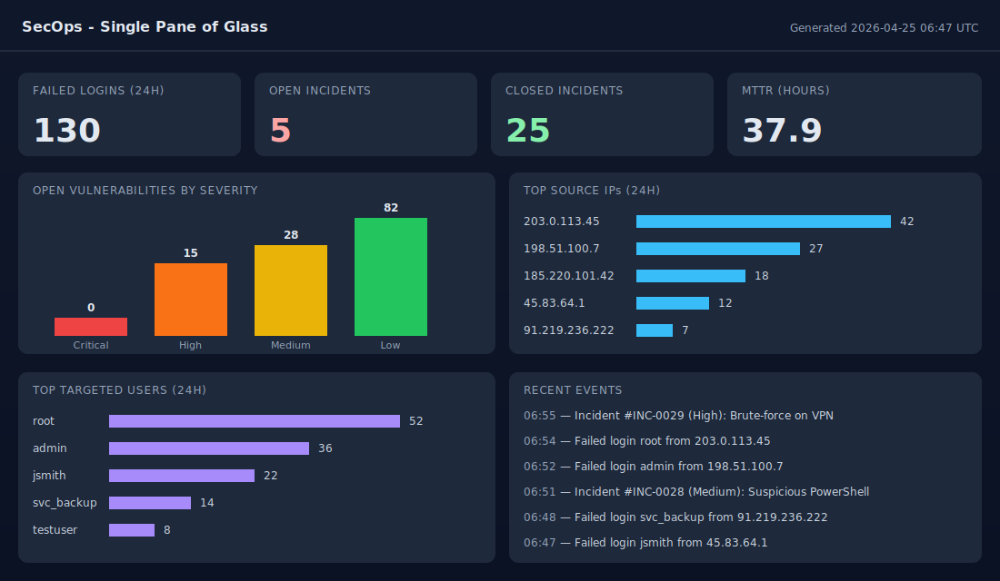

# App Health Dashboard



[](https://github.com/diallosanazy/app-health-dashboard/actions/workflows/ci.yml)

A lightweight web-app health dashboard built with **Python (Flask) + Chart.js**.
It pulls metrics from CSV/JSON feeds and renders them on one page so a small
dev team can see the state of the app at a glance — the kind of "single page"
the rest of the team asks the on-call engineer for every morning.

I started this during my software-engineering internship at The Difference App
to replace a Slack thread of "what's broken right now?" pings. The same data
exports to a flat CSV so it can be picked up by **Power BI** for leadership.

## What it shows

- **Errors (24h)** — count over the last 24h, grouped by endpoint and user.
- **Open bugs** — count by severity (Critical / High / Medium / Low).
- **Tickets** — open vs. closed, plus **mean time to fix (MTTF)** in hours.
- **Recent events feed** — the latest 20 errors and ticket changes for context.

## Stack

- Python 3.10+, Flask, pandas
- Chart.js (loaded from CDN, no build step)
- Optional: Power BI Desktop reads `data/metrics_export.csv`

## Quickstart

```bash
git clone https://github.com/diallosanazy/app-health-dashboard.git
cd app-health-dashboard
python3 -m venv .venv && source .venv/bin/activate   # Windows: .venv\Scripts\activate
pip install -r requirements.txt
python3 app.py
```

Open <http://localhost:5001>.

The repo ships with synthetic sample data under `data/` so it works out of the
box. Drop your own `errors.csv`, `bugs.csv`, and `tickets.csv` in that folder —
same column names — and refresh.

## Power BI

`data/metrics_export.csv` is rewritten on every page load. Open Power BI Desktop →
*Get Data → Text/CSV* → point at that file → build whatever visuals you like.
Set a scheduled refresh against the same folder for live dashboards.

## File layout

```
app-health-dashboard/
├── app.py                 # Flask app + metric calculations
├── requirements.txt
├── data/
│   ├── errors.csv
│   ├── bugs.csv
│   └── tickets.csv
└── templates/
    └── dashboard.html     # Chart.js dashboard UI
```

## Roadmap

- Pull from a real APM (Datadog / Sentry / New Relic) instead of CSV.
- Auth in front of the dashboard (Flask-Login + SSO).
- Slack alerts when error rate spikes.

## License

MIT
